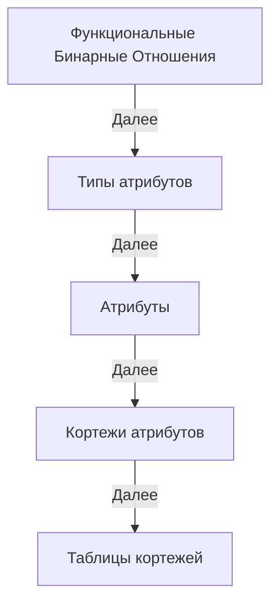

 

# Theory
Links Theory

##   Определения Теории связей в терминах Теории множеств

1. Идентификатор вектора - уникальный идентификатор, каждый из которых связан с определенным вектором.
  Последовательность идентификаторов векторов: L ⊆ ℕ₀.

2. Вектор идентификаторов: это вектор, состоящий из нуля или нескольких идентификаторов векторов,
  где количество индексов соответствует количеству элементов вектора.
  Множество всех векторов идентификаторов длины n ∈ ℕ₀: Vn = Lⁿ.
  Декартова степень Lⁿ всегда даст вектор длины n, так как все его компоненты будут одного и того же типа L.
  Другими словами, Lⁿ представляет собой множество всех возможных n-элементных векторов, где каждый элемент вектора принадлежит множеству L.

3. Ассоциация - это упорядоченная пара, состоящая из идентификатора вектора и вектора идентификаторов.
  Эта структура служит для отображения между идентификаторами и векторами или точками в пространстве.
  Множество всех ассоциаций: A = L × Vn.

4. Семейство функций: ∪_f {anetvⁿ | n ∈ ℕ₀} ⊆ A.
  Здесь ∪ обозначает объединение всех функций в семействе {anetvⁿ},
  ⊆ обозначает 'это подмножество', а A - множество всех ассоциаций.
  Это говорит о том, что все упорядоченные пары, полученные от функций anetvⁿ, являются подмножеством A.

5. Ассоциативная сеть векторов длины n (или n-мерная асеть) из семейства функций {anetvⁿ},
  anetvⁿ : L → Vn отображает идентификатор l из множества L в кортеж идентификаторов длины n,
  который принадлежит множеству Vn, фактически идентифицирует точки в n-мерном пространстве.
  'n' в anetvⁿ указывает на то, что функция возвращает вектора, содержащие n идентификаторов. 

6. Дуплет идентификаторов (упорядоченная пара или двухмерный вектор): D = L²
  Это множество всех упорядоченных пар (L, L), или вторая декартова степень L.

7. Ассоциативная сеть дуплетов (или двумерная асеть): anetd : L → L².

8. Пустой вектор представлен пустым множеством: () представлено как ∅.
  Вектор длины n ∈ ℕ₀ можно представить как вложенные упорядоченные пары.

9. Ассоциативная сеть вложенных упорядоченных пар: anetl : L → NP,
  где NP = {(∅,∅) | (l,np), l ∈ L, np ∈ NP} - это множество вложенных упорядоченных пар,
  которое состоит из пустых пар, и пар содержащих один или более элементов.

##  Этапы доказательства эквивалентности реляционной модели и ассоциативной сети дуплетов

**ФБО**: Функциональные бинарные отношения необходимы для хранения функций агрегирования и типизирования.

**Типы атрибутов**: Описание ассоциативной структуры типов Boolean, Integer, String и т.д. Это необходимо для описания типов и идентификации атрибутов реляционной модели.

**Атрибуты**: Описание ассоциативной структуры атрибутов и ассоциации с его типом с помощью ФБО.

**Кортежи атрибутов (записей)**: Описание, типизация и идентификация кортежей атрибутов. Кортежи атрибутов как отдельный тип.

**Таблицы кортежей (таблицы)**: Описание, типизация и идентификация таблиц кортежей. Таблицы кортежей как отдельный тип.

## Определения Теории связей в собственных терминах (черновик)
[LinksPlatform/doc/articles/links-theory.md](https://github.com/Konard/LinksPlatform/blob/master/doc/articles/links-theory.md)

В теории связей есть только связи и всё есть связь, но нет никаких типов, типов типов, множеств и элементов.

Теория связей это метатеория, потому что она описывает всё, в том числе саму себя и субъекта который её синтезирует и использует.

### Субъект

Это последовательный трансформатор связей.

Субъект есть функция: LxL -> L

### Функция

### Нотация связей

Это система условных письменных обозначений, принятая в Теории связей, для описания субъектом связей в виде последовательностей.

#### Нотация связей LiNo

**связь: (ссылка: ссылка ссылка)**

, где

**:** - разделяет ссылку на саму связь (слева от : ) и значение связи (справа от : )

**(** - задаёт начало описания связи

**)** - задаёт конец описания связи

**(** и **)** позволяют отделить описание связей друг от друга в нотации связей

"Описание связи" - это отдельный термин нотации связей.

### Связь

Это то, что различает субъект.

Связь имеет рекурсивную структуру: связь связывает связи.

Связь описывается последовательностью ссылок на связи.

это самое простое определение которое можно найти

но что оно на самом деле делает это убирает прямую рекурсию из определения

на самом деле связь состоит из связей 

Связь состоит из ссылок, а ссылки это нематериализованные (виртуальная, воображаемая) связи, т.е. не имеющая своей ссылки/идентификатора/адреса.

При материализация своя ссылка/идентификатор появляются.

Связь это последовательность, которая полностью описывает любую связь из **L ↦ L²** , т.е. это значение связи это L².

L² - все значения связей в сети связей

L - все ссылки на связи в сети связей

ссылка связи ↦ значение связи

(ссылка_связи: значение_связи)

Например: **(1: 1 1)** - это связь в нотации связей.

В теории типов это может быть описано как кортеж **(1, (1, 1))**

Первый элемент это ссылка связи, второй элемент это последовательность в данном случае дуплет из ссылок на связи.

Теория связей не задаёт им никаких имён.

К примеру там может быть не дуплет, а N-последовательность и бесконечное количество имён давать нет смысла.

Названия для первого компонента дуплета - начало, а второго компонента дуплета - конец, подходит для большинства контекстов, но не для всех.

связь это у чего есть ссылка на себя и/или ссылки на другие связи (например начало и конец)

ссылка это связь между связями

она может быть материализована в связи, но это не обязательно

### Значение связи

Значение связей это N-последовательность ссылок на связи, последовательность ссылок на связи это значение связи.

То есть:

() - 0-последовательность

(1) - 1-последовательность

(1 1) - 2-последовательность. Двойная связь это связь у которой значение это 2-последовательность или упорядоченная пара.

(1 1 1) - 3-последовательность

и т.д.

Начало и конец это пример для случая 2-последовательность:

(1 2) - здесь 1 это начало, а 2 это конец.

### Последовательность

Последовательность является фундаментальным понятием, она есть же и есть связь.

Есть два варианта этой последовательности: с материализованной ссылокой на себя и без.
То есть материализовано:
(1, 2, 3)
(1: 2 3)
1 ↦ (2, 3)

нематерилизовано:
(2, 3)
(2 3)
(2, 3) 
Это всё одна и та же связь начинающаяся в 2 и заканчивающаяся в 3.
Или просто которая ссылается на 2 и на 3.
Где 2 это ссылка (номер) другой связи.
Где 3 это ссылка (номер) другой связи.

Тройные связи и связи с N количеством ссылок на другие связи могут быть представлены в виде последовательностей, которые построены из двойных связей.

Конечная последовательность или упорядоченный список из n ссылок, где n - неотрицательное целое число.

Последовательность определяет порядок и совокупность ссылок.

Последовательность это всегда последовательность ссылок на последовательности.

Существует только одна 0-последовательность, как символ отсутствия ссылок и называется пустой последовательностью.

Синглет это последовательность из одной ссылки.

Дуплет или упорядоченная пара это последовательность из двух ссылок.

Кортеж может быть формально определен из упорядоченных пар путем повторения, начиная с упорядоченных пар; действительно, n-кортеж может быть идентифицирован с упорядоченной парой его (n − 1) первых элементов и его n-го элемента.

Последовательность это либо элемент (синглет из элемента), либо элемент и элемент (дуплет из элементов), либо элемент и последовательность (дуплет из них и далее так же), либо последовательность и элемент, либо последовательность и последовательность.

У связи есть только ссылка на связь и значение связи, больше у неё ничего нет.

### Ссылка связи

Ссылка связи это адрес связи по которому можно получить (откуда?) значение связи.

Между ссылкой и значением нет материализованного отношения/связи.

Такое отношение только подразумевается, но не существует.

(Не получить откуда, а номер который проассоциирован со связью. Благодаря которому на неё можно ссылаться.)

Допустим у нас есть связь:

(1: 2 3)

Тогда ссылка 1 материализуется в связь:

(1 1)

Пример того как можно описать связь между узлами (связями) двух бинарных деревьев.
Путь движения по бинарному дереву (дереву связей) можно задать простой битовой последовательностью, но подобная битовая последовательность не может описать как двигаться в асети дуплетов (конечно за исключением случая когда асеть дуплетов находится в обычной ОЗУ). Для этого необходим ассоциативный бит, т.е. бит 4х значной логики. В этой логике добавляется бит контекста, в итоге ассоциативный бит состоит из 2х обычных битов. Второй бит говорит о том, что мы двигаемся не по бинарному дереву (0), а по дереву контекста (1). Теперь мы можем погружаться в контекст или выходить из него. При погружении в контекст, мы создаём новый путь движения по бинарному дереву, при выходе из контекста мы проводим новую связь от последней связи к контекстной.
Например: ссылка 1010010(10111)
1. вначале создаётся нулевой контекст, т.е. строим связь от корневой
2. далее в нём мы проходим по бинарному дереву от корневой связи к связи с бинарным адресом 1010010 (здесь 0 и 1 это тоже ссылки на связи)
3. далее скобка "(" говорит о создании вложенного контекста, т.е. мы сохраняем предыдущую связь на которой остановились и начинаем вновь адресоваться от корневой связи, проходя по бинарному дереву до связи с бинарным адресом 10111
4. далее закрывающая контекст скобка ")" говорит о том что надо выбрать связь от адреса 10111 до контекстной связи, т.е. 1010010.

На самом деле в последовательности ссылок могут быть любые знаки (за исключением: ":", "(", ")" ).
буквы как ссылки есть последовательности ссылок, т.е. буква это последовательность бит (биты 0 и 1 это ссылки на связи). Количество связей между бинарными деревьями может быть каким угодно. Таким образом какой нибудь сложный адрес типа mouse(pos(x)) или x(pos(mouse)) приведёт к конкретной связи между тремя бинарными деревьями слов (каждое из которых тоже будет результатом адресации между бинарными деревьями букв).

### Материализация ссылок

Перевод воображаемой/подразумеваемой связи в реально материализованную (записанную как отдельную связь) связь.

Возьмём связь:

(1: 2 3)

Материализация ссылок 2 и 3 выглядит так:

(1 2)

(1 3)

Материализовать ссылки можно бесконечно рекурсивно пораждая бесконечное количество материализаций

Саму связь можно материализовать в последовательность, то есть:

1 ↦ (2, 3)

материализуется в

(1, (2, 3))

x ↦ (1, (2, 3))

Материализованная связь это последовательность включая ссылку на саму связь в своёй 0-ой ссылке.
Последовательности могут быть только из ссылок на связи.

### Дерево связей

Структура, т.е. порядок и совокупность связей может соответствовать некоторому шаблону.

------------------------------------------------------------

    "В начале была последовательность, и последовательность была у субъекта, и последовательность была субъектом."

Метатеория субъективна, потому что записана в виде последовательности L.

Единство связи обособляет её и как следствие делает различимой для субъекта.
Несвязь (Гегелевское отрицание связи) это последовательность.
Т.е. несвязь или несвязность есть не единство, поэтому неразличимо для субъекта.
Единство потока в дуальности соединяющей источник единства и цель единства.
Как можно сослаться или указать на единство?
Нужно дать его субъективные координаты, т.е. ссылка будет относительной.

Переход по ссылке это непосредственное отношение субъекта к объекту, где объект тоже связь, тоже единство дуальности.
Связь это идентифицируемое субъектом единство дуальности.
Каждый субъект идентифицирует единства дуальностей субъективно, поэтому [нотация](https://github.com/deep-foundation/deep-theory/blob/main/associative_proofs/coq/ANetDefs.v) ассоциативной сети дуплетов субъективна.

Путь отнесения субъекта к объекту, относителен из-за субъективности и образует последовательность.
Ссылка на связь есть субъективный путь отнесения (отношения или движения) к единству.
Субъект в данном случае выступает началом координат, или корнем асети дуплетов.
Таким образом субъективно асеть дуплетов описывает пути к связи путей.

L -> LxL функция объективации хранит асеть дуплетов.
LxL -> L функция субъективации конструирует дуплеты.

L это путь субъекта к со-единению путей.
LxL это связь путей, их единство или направленное со-единение.

В [linksplatform](https://github.com/linksplatform) L это адрес в памяти. Субъект это процессор.
Процессор доступается к связям ссылок по адресу.
Память организована как бинарное дерево по которому надо идти в соответствии с битовым словом поворачивая то налево (0) то направо (1).
Это осуществляет дешифратор шины адреса.
Так например надо повернуть 32 раза. После этого мы можем считать с шины данных связь двух других путей по бинарному дереву.

Ачисла ([ассоциативные числа](https://github.com/deep-foundation/deep-theory/blob/05300f0ecbb8d48d78e7cae228fd88568d48eb07/associative_proofs/coq/anum.v#L78)) организуют сеть деревьев в ассоциативной памяти, представляя из себя гибрид бинарного дерева адресации и ячеек памяти, только в отличие от обычной памяти, ячейки находятся в каждом узле дерева и дерево не имеет фиксированной глубины.

Материализация это единение несвязи, т.е. последовательности.
Когда мы со-единяем последовательность, то получаем связь.
Это и есть материализация.
Т.е. материализация это LxL -> L

L = 123 - это ссылка в виде последовательностей цифр, которые тоже есть ссылки
т.е. можно записать (1,(2,(3,0))))

каждая цифра это последовательность бит, которые тоже есть ссылки.

1 = (0(0(0(0(0(0(0(1))))))))
2 = (0(0(0(0(0(0(1(0))))))))
3 = (0(0(0(0(0(0(1(1))))))))

windowpointx

( -> 0x1
) -> 0x0
1 -> 1x1
0 -> 1x0

L = (LD) = (L(LL)) - ссылка, ассоциация
D = (LL) - дуплет

8 -> 8x8

0 -> 0x1
1 -> 0x0
