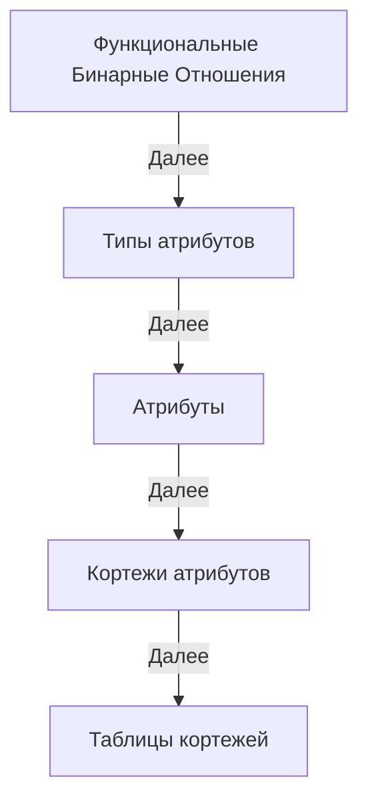

 

# Theory
Links Theory

##   Определения Теории связей в терминах Теории множеств

1. Идентификатор вектора - уникальный идентификатор, каждый из которых связан с определенным вектором.
  Последовательность идентификаторов векторов: L ⊆ ℕ₀.

2. Вектор идентификаторов: это вектор, состоящий из нуля или нескольких идентификаторов векторов,
  где количество индексов соответствует количеству элементов вектора.
  Множество всех векторов идентификаторов длины n ∈ ℕ₀: Vn = Lⁿ.
  Декартова степень Lⁿ всегда даст вектор длины n, так как все его компоненты будут одного и того же типа L.
  Другими словами, Lⁿ представляет собой множество всех возможных n-элементных векторов, где каждый элемент вектора принадлежит множеству L.

3. Ассоциация - это упорядоченная пара, состоящая из идентификатора вектора и вектора идентификаторов.
  Эта структура служит для отображения между идентификаторами и векторами или точками в пространстве.
  Множество всех ассоциаций: A = L × Vn.

4. Семейство функций: ∪_f {anetvⁿ | n ∈ ℕ₀} ⊆ A.
  Здесь ∪ обозначает объединение всех функций в семействе {anetvⁿ},
  ⊆ обозначает 'это подмножество', а A - множество всех ассоциаций.
  Это говорит о том, что все упорядоченные пары, полученные от функций anetvⁿ, являются подмножеством A.

5. Ассоциативная сеть векторов длины n (или n-мерная асеть) из семейства функций {anetvⁿ},
  anetvⁿ : L → Vn отображает идентификатор l из множества L в кортеж идентификаторов длины n,
  который принадлежит множеству Vn, фактически идентифицирует точки в n-мерном пространстве.
  'n' в anetvⁿ указывает на то, что функция возвращает вектора, содержащие n идентификаторов. 

6. Дуплет идентификаторов (упорядоченная пара или двухмерный вектор): D = L²
  Это множество всех упорядоченных пар (L, L), или вторая декартова степень L.

7. Ассоциативная сеть дуплетов (или двумерная асеть): anetd : L → L².

8. Пустой вектор представлен пустым множеством: () представлено как ∅.
  Вектор длины n ∈ ℕ₀ можно представить как вложенные упорядоченные пары.

9. Ассоциативная сеть вложенных упорядоченных пар: anetl : L → NP,
  где NP = {(∅,∅) | (l,np), l ∈ L, np ∈ NP} - это множество вложенных упорядоченных пар,
  которое состоит из пустых пар, и пар содержащих один или более элементов.

##  Этапы доказательства эквивалентности реляционной модели и ассоциативной сети дуплетов

**ФБО**: Функциональные бинарные отношения необходимы для хранения функций агрегирования и типизирования.

**Типы атрибутов**: Описание ассоциативной структуры типов Boolean, Integer, String и т.д. Это необходимо для описания типов и идентификации атрибутов реляционной модели.

**Атрибуты**: Описание ассоциативной структуры атрибутов и ассоциации с его типом с помощью ФБО.

**Кортежи атрибутов (записей)**: Описание, типизация и идентификация кортежей атрибутов. Кортежи атрибутов как отдельный тип.

**Таблицы кортежей (таблицы)**: Описание, типизация и идентификация таблиц кортежей. Таблицы кортежей как отдельный тип.

## Определения Теории Связей в собственных терминах (черновик)

Теория связей это метатеория, потому что она может описать всё что угодно, в том числе описать сами связи.

Структура связей может соответствовать некоторому шаблону.

В теории связей есть только связи, но нет никаких типов.

### Нотация связей

**связь: (ссылка: ссылка ссылка)** - это нотация связей, но её не нужно вводить в самой теории, потому что она не нужна для теории связей.

**:** - разделяет ссылку на саму связь (слева от :) от собственно значения связи (справа от :)

**(** - задаёт начало описания связи

**)** - задаёт конец описания связи

тут речь о том что такое "описание связи" и это отдельный термин нотации связей

**(** и **)** позволяют отделить описание связей друг от друга в нотации связей

### Связь

Связь это последовательность, которая полностью описывает любую связь из **L ↦ L²**

Например: **(1: 1 1)** - это связь в нотации связей.

В теории типов это может быть описано как кортеж **(1, (1, 1))**

Первый элемент это ссылка связи, второй элемент это последовательность в данном случае дуплет из ссылок на связи.

Теория связей не задаёт им никаких имён.

К примеру там может быть не дуплет, а N-последовательность и бесконечное количество имён давать нет смысла.

Названия для первого компонента дуплета - начало, а второго компонента дуплета - конец, подходит для большинства контекстов, но не для всех.

связь это у чего есть ссылка на себя и/или ссылки на другие связи (например начало и конец)

ссылка это связь между связями

она может быть материализована в связи, но это не обязательно

### Значение связи

Значение связи это N-последовательность, то есть:

() - 0-последовательность

(1) - 1-последовательность

(1 1) - 2-последовательность

(1 1 1) - 3-последовательность

и т.д.

Начало и конец это пример для случая 2-последовательность:

(1 2) - здесь 1 это начало, а 2 это конец.

### Последовательность

Конечная последовательность или упорядоченный список из n ссылок, где n - неотрицательное целое число.

Последовательность определяет порядок и совокупность ссылок.

Существует только одна 0-последовательность, как символ отсутствия ссылок и называется пустой последовательностью.

Синглет это последовательность из одной ссылки.

Дуплет или упорядоченная пара это последовательность из двух ссылок.

Кортеж может быть формально определен из упорядоченных пар путем повторения, начиная с упорядоченных пар; действительно, n-кортеж может быть идентифицирован с упорядоченной парой его (n − 1) первых элементов и его n-го элемента.

Последовательность это либо элемент (синглет из элемента), либо элемент и элемент (дуплет из элементов), либо элемент и последовательность (дуплет из них и далее так же), либо последовательность и элемент, либо последовательность и последовательность.

У связи есть только ссылка на связь и значение связи, больше у неё ничего нет.

### Ссылка связи

Ссылка связи это адрес связи по которому можно получить значение связи.

Допустим у нас есть связь:

(1: 2 3)

Тогда ссылка 1 материализуется в связь:

(1 1)

### Материализация ссылок

Перевод воображаемой/подразумеваемой связи в реально материализованную (записанную как отдельную связь) связь.

Возьмём связь:

(1: 2 3)

Материализация ссылок 2 и 3 выглядит так:

(1 2)

(1 3)

Материализовать ссылки можно бесконечно рекурсивно пораждая бесконечное количество материализаций
