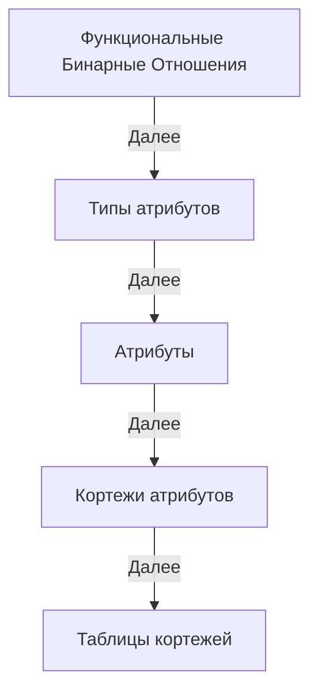

 

# Theory
Links Theory

##   Определения Теории связей в терминах Теории множеств

1. Идентификатор вектора - уникальный идентификатор, каждый из которых связан с определенным вектором.
  Последовательность идентификаторов векторов: L ⊆ ℕ₀.

2. Вектор идентификаторов: это вектор, состоящий из нуля или нескольких идентификаторов векторов,
  где количество индексов соответствует количеству элементов вектора.
  Множество всех векторов идентификаторов длины n ∈ ℕ₀: Vn = Lⁿ.
  Декартова степень Lⁿ всегда даст вектор длины n, так как все его компоненты будут одного и того же типа L.
  Другими словами, Lⁿ представляет собой множество всех возможных n-элементных векторов, где каждый элемент вектора принадлежит множеству L.

3. Ассоциация - это упорядоченная пара, состоящая из идентификатора вектора и вектора идентификаторов.
  Эта структура служит для отображения между идентификаторами и векторами или точками в пространстве.
  Множество всех ассоциаций: A = L × Vn.

4. Семейство функций: ∪_f {anetvⁿ | n ∈ ℕ₀} ⊆ A.
  Здесь ∪ обозначает объединение всех функций в семействе {anetvⁿ},
  ⊆ обозначает 'это подмножество', а A - множество всех ассоциаций.
  Это говорит о том, что все упорядоченные пары, полученные от функций anetvⁿ, являются подмножеством A.

5. Ассоциативная сеть векторов длины n (или n-мерная асеть) из семейства функций {anetvⁿ},
  anetvⁿ : L → Vn отображает идентификатор l из множества L в кортеж идентификаторов длины n,
  который принадлежит множеству Vn, фактически идентифицирует точки в n-мерном пространстве.
  'n' в anetvⁿ указывает на то, что функция возвращает вектора, содержащие n идентификаторов. 

6. Дуплет идентификаторов (упорядоченная пара или двухмерный вектор): D = L²
  Это множество всех упорядоченных пар (L, L), или вторая декартова степень L.

7. Ассоциативная сеть дуплетов (или двумерная асеть): anetd : L → L².

8. Пустой вектор представлен пустым множеством: () представлено как ∅.
  Вектор длины n ∈ ℕ₀ можно представить как вложенные упорядоченные пары.

9. Ассоциативная сеть вложенных упорядоченных пар: anetl : L → NP,
  где NP = {(∅,∅) | (l,np), l ∈ L, np ∈ NP} - это множество вложенных упорядоченных пар,
  которое состоит из пустых пар, и пар содержащих один или более элементов.

##  Этапы доказательства эквивалентности реляционной модели и ассоциативной сети дуплетов

**ФБО**: Функциональные бинарные отношения необходимы для хранения функций агрегирования и типизирования.

**Типы атрибутов**: Описание ассоциативной структуры типов Boolean, Integer, String и т.д. Это необходимо для описания типов и идентификации атрибутов реляционной модели.

**Атрибуты**: Описание ассоциативной структуры атрибутов и ассоциации с его типом с помощью ФБО.

**Кортежи атрибутов (записей)**: Описание, типизация и идентификация кортежей атрибутов. Кортежи атрибутов как отдельный тип.

**Таблицы кортежей (таблицы)**: Описание, типизация и идентификация таблиц кортежей. Таблицы кортежей как отдельный тип.

