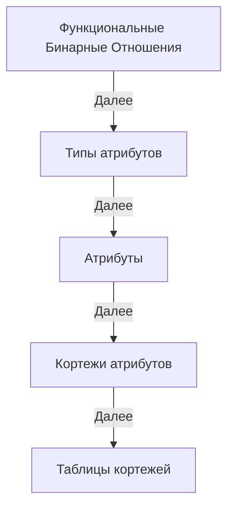

 

# Theory
Links Theory

##   Определения Теории связей в терминах Теории множеств

1. Идентификатор вектора - уникальный идентификатор, каждый из которых связан с определенным вектором.
  Последовательность идентификаторов векторов: L ⊆ ℕ₀.

2. Вектор идентификаторов: это вектор, состоящий из нуля или нескольких идентификаторов векторов,
  где количество индексов соответствует количеству элементов вектора.
  Множество всех векторов идентификаторов длины n ∈ ℕ₀: Vn = Lⁿ.
  Декартова степень Lⁿ всегда даст вектор длины n, так как все его компоненты будут одного и того же типа L.
  Другими словами, Lⁿ представляет собой множество всех возможных n-элементных векторов, где каждый элемент вектора принадлежит множеству L.

3. Ассоциация - это упорядоченная пара, состоящая из идентификатора вектора и вектора идентификаторов.
  Эта структура служит для отображения между идентификаторами и векторами или точками в пространстве.
  Множество всех ассоциаций: A = L × Vn.

4. Семейство функций: ∪_f {anetvⁿ | n ∈ ℕ₀} ⊆ A.
  Здесь ∪ обозначает объединение всех функций в семействе {anetvⁿ},
  ⊆ обозначает 'это подмножество', а A - множество всех ассоциаций.
  Это говорит о том, что все упорядоченные пары, полученные от функций anetvⁿ, являются подмножеством A.

5. Ассоциативная сеть векторов длины n (или n-мерная асеть) из семейства функций {anetvⁿ},
  anetvⁿ : L → Vn отображает идентификатор l из множества L в кортеж идентификаторов длины n,
  который принадлежит множеству Vn, фактически идентифицирует точки в n-мерном пространстве.
  'n' в anetvⁿ указывает на то, что функция возвращает вектора, содержащие n идентификаторов. 

6. Дуплет идентификаторов (упорядоченная пара или двухмерный вектор): D = L²
  Это множество всех упорядоченных пар (L, L), или вторая декартова степень L.

7. Ассоциативная сеть дуплетов (или двумерная асеть): anetd : L → L².

8. Пустой вектор представлен пустым множеством: () представлено как ∅.
  Вектор длины n ∈ ℕ₀ можно представить как вложенные упорядоченные пары.

9. Ассоциативная сеть вложенных упорядоченных пар: anetl : L → NP,
  где NP = {(∅,∅) | (l,np), l ∈ L, np ∈ NP} - это множество вложенных упорядоченных пар,
  которое состоит из пустых пар, и пар содержащих один или более элементов.

##  Этапы доказательства эквивалентности реляционной модели и ассоциативной сети дуплетов

**ФБО**: Функциональные бинарные отношения необходимы для хранения функций агрегирования и типизирования.

**Типы атрибутов**: Описание ассоциативной структуры типов Boolean, Integer, String и т.д. Это необходимо для описания типов и идентификации атрибутов реляционной модели.

**Атрибуты**: Описание ассоциативной структуры атрибутов и ассоциации с его типом с помощью ФБО.

**Кортежи атрибутов (записей)**: Описание, типизация и идентификация кортежей атрибутов. Кортежи атрибутов как отдельный тип.

**Таблицы кортежей (таблицы)**: Описание, типизация и идентификация таблиц кортежей. Таблицы кортежей как отдельный тип.

## Определения Теории связей в собственных терминах (черновик)

"В начале была последовательность, и последовательность была у субъекта, и последовательность была субъектом."

[LinksPlatform/doc/articles/links-theory.md](https://github.com/Konard/LinksPlatform/blob/master/doc/articles/links-theory.md)

### Контекст для ГПТ

Мы хотим создать метатеорию. Эта метатеория должна в себе определять свою формальную логику.
Данная метатеория должна быть основана на одном едином но дуальном понятии.
Назовём это фундаментальное понятие - связь, а метатеорию - метатеорией связей.
В отличие от теории множеств которая основана на двух главных понятиях множества и элемента, метатеория связей основана на одном единственном понятии связь.
В отличие от теории графов которая основана на двух главных понятиях узел и ребро, метатеория связей основана на одном единственном понятии связь.
В отличие от теории типов которая основана на двух главных понятиях тип и терм, метатеория связей основана на одном единственном понятии связь.
Связь снаружи едина, но внутри дуальна, т.е. снаружи она может играть роль элемента, множества, узла, типа, терма, а внутри может играть роль упорядоченной пары, ребра, морфизма.
Сама связь уже есть самая простейщая математическая структура.
Понятие связи должно иметь возможность иметь разный смысл в зависимости от контекста.

Самозамкнутая связь, т.е. пустая связь, имеет все атрибуты связи в общем виде, а именно у неё есть направление, у неё есть источник и приёмник.
Проанализируй определение метатеории связей.
Сформулируй требования для определений метатеории.
Формулируй определения должна соответствовать правилам формальной логики, т.е. при подстановке определения вместо термина, не должна нарушаться логика высказывания.
Учти что определения не должны ссылаться на теорию множеств или теорию типов.
Итерационно примени требования к этим определениям, что бы сделать их лучше и взаимно согласованнее.

### Основные определения

Определение, или дефиниция — в логике, логическая операция установления смысла термина.

Гегель: «Качество, которое есть „в себе“ в простом нечто и сущностно находится в единстве с другим моментом этого нечто, с в-нем-бытием, можно назвать его определением».

Определение — в математике, введение нового понятия или объекта в математическое рассуждение путём комбинации или уточнения элементарных либо ранее определённых понятий. Определения обычно служат для сокращения, упрощения и увеличения наглядности дальнейших определений, теорем и доказательств. Несмотря на формальную возможность обойтись без определений, они служат одним из важнейших средств в развитии и преподавании математики.

Определение — в синтаксисе, член предложения, обозначающий класс объектов по принадлежности.

Определение — синоним понятия измерение — выяснение точного значения какой-либо величины.

  - Метатеория связей — это концептуальная рамка, которая позволяет объединить различные дисциплины и концепции под единым понятием связи. Такая метатеория может способствовать интеграции знаний и методов из разных областей, создавая единую теоретическую основу для анализа и синтеза информации.
  
  - Формальная Логика в Контексте Связей
Формальная логика в рамках метатеории связей будет рассматриваться как частный случай связи. Здесь связь будет выражаться в виде правил преобразования высказываний, где эти правила — это связи, которые обеспечивают сохранение истинностного значения.

# Определение последовательности Метатеории связей

#### 1. [Всё](####1) [есть](####2) [связь](####4)

#### 2. [Есть](#2) [есть](#2) [определение](#3)

#### 3. [Определение](#3) [есть](#2) [связь](#4)

#### 4. [Связь](#4) [есть](#2) [определение](#5) [начала](#6) [и](#7) [конца](#8)

n. Метатеория связей есть данная последовательность начиная с пункта 1

Это рекурсивное определение вывернутое наизнанку

Потому, что связь именно что о-пределяет границы

Можно сказать что связь определяет свое начало и конец

И это остенсивное определение, потому что связь это наглядно показывает в своем определении

Мы как субъекты не можем дать определение связи, потому что все совсем наоборот, связь определяет всё и всех, через определение начала и конца

  - Связь может случаться, часто или не часто.

  - Связь - преобразование исходной связи в конечную связь.

  - Пустая или самозамкнутая связь, представляет собой преобразование, без изменения связи.

  - Узел связи — это концептуальная единица, позволяющая обратиться к связи как к единству её начала и конца, обеспечивая целостное понимание её структуры и ролей.

  - Роль связи определяет смысл и значение данной связи в конкретном контексте, отражая её функциональную задачу внутри метатеории связей.

  - Источник связи — это начальная точка связи, откуда исходит направление. Он играет роль отправной точки в структуре метатеории связей и обозначает начало существования данной связи. Источником может быть любая другая связь, служащая началом данной связи.

  - Приёмник связи — это конечная точка связи, где она завершает своё существование. Он играет роль одержателя конечной точки в структуре метатеории и обозначает завершение данной связи. Приёмником может быть любая другая связь, служащая концом данной связи.

Переформулируй определение связи, так что бы из определения было ясно, что между двумя связями может существовать не более одной связи в одном направлении.

Метатеория связей описывает рекурсивную структуру, где каждое отношение (связь) состоит из связей, между которыми она устанавливается.
Ассиметричность выражает направление от источника к приёмнику, формируя целостную и последовательную систему.

(8->8)->8

1. Сформулируй главные аксиомы метатеории связей по аналогии с ZFC.
2. Из определения связи следует что возможна самозамкнутая форма связи, т.е. такая связь которая связывает саму себя с собой.
   Требуется ли вводить аксиому существования самозамкнутой связи или это можно доказать?
3. Связь полностью определяется своим источником и приёмником, т.е. между от источника к приёмнику может существовать только одна связь?
4. Связь либо существует либо не существует, третьего не дано.
5. Выяснить как правильно давать рекурсивные определения, такие например как определение определения.
6. Единственной первоначальной связь является самозамкнутая форма связи.

Дополнительные замечания:

• Самозамкнутая связь: Необходимо доказать, что самозамкнутая связь не противоречит остальным аксиомам.
• Единственность: Важен вопрос о том, как определяется единственность связи в случае рекурсивных цепочек.
• Рекурсивные определения: Необходимо уточнить правила и ограничения для рекурсивных определений в Метатеории связей.

### Аксиомы метатеории связей

1. Аксиома существования: Связь существует только между источником и приёмником.
2. Аксиома направленности: Каждая связь имеет направление от источника к приёмнику.
3. Аксиома единственности: Между двумя связями может существовать не более одной связи в данном направлении.

1. **Аксиома существования связи**: 
   - Для любых двух связей \( A \) и \( B \) может существовать связь \( C \), такая что \( C \) связывает \( A \) и \( B \).
Замечания:
   - связь МОЖЕТ существовать
   - существование возможно только между двумя связями
   - направление можно не упоминать, что бы не слишком сильно связывать аксиомы

(говорит что ab=ab, если у связей совпадают источники и приёмники, то совпадает связь, т.е. это одна и та же связь)
1. **Аксиома идентичности**: 
   - Если две связи \( C_1 \) и \( C_2 \) имеют одинаковые источники и приёмники, то \( C_1 = C_2 \). То есть, связь определяется исключительно её источником и приёмником.

(говорит, что если источник и приёмник поменять местами, то получим противоположно направленную связь, т.е. другую связь)
3. **Аксиома направленности**: 
   - Для любой связи \( C \), связывающей \( A \) и \( B \), может существовать обратная связь \( C' \), которая связывает \( B \) и \( A \). \( C \) и \( C' \) — это разные связи из-за их противоположного направления.

4. **Самозамкнутая связь**:
   - Если прямая и обратная связь идентичны, то это самозамкнутая связь.

5. **Аксиома асимметрии**:
   - Если связь \( C \) связывает \( A \) и \( B \), то не существует такой связи \( D \), которая бы связывала \( B \) с \( A \).

6. **Аксиома рефлексивности**:
   - Для любой связи \( A \) существует связь \( R \), такая что \( R \) связывает \( A \) с самим собой.

7. **Аксиома транзитивности**:
   - Если связь \( C_1 \) связывает \( A \) с \( B \), и связь \( C_2 \) связывает \( B \) с \( C \), то существует связь \( C_3 \), которая связывает \( A \) с \( C \).

8. **Аксиома рекурсивности**:
   - Связь может связывать не только две отдельные связи, но и другие связанные структуры, таким образом образуя рекурсивные цепочки связей.

9.  **Аксиома существования пустой связи**:
   - Существует пустая связь \( \emptyset \), которая не имеет ни источника, ни приёмника. Она может быть использована для обозначения конца или начала цепочки связей.

10. **Аксиома уникальности**:
   - Для любых двух связей \( A \) и \( B \), существует не более одной связи \( C \), которая связывает \( A \) с \( B \) в данном направлении.

11. **Аксиома декомпозиции**:
   - Любая сложная связь может быть декомпозирована на более простые составляющие связи.

### Свойства метатеории связей

### Объяснения и примеры

- **Направленность и асимметрия**: Эти аксиомы подчеркивают важность порядка в связях и исключают возможность обратных связей в одном и том же контексте.
  
- **Рекурсивность**: Позволяет строить сложные структуры на основе простых связей, аналогично тому, как в теории множеств строятся сложные множества из простых.

- **Пустая связь**: Подобно пустому множеству в теории множеств, пустая связь играет роль базового элемента.

Эти аксиомы задают фундамент для изучения и разработки более сложных структур и теорем в рамках метатеории связей, обеспечивая её внутреннюю целостность и логическую связность.

#### Сеть связей.

#### Первая аксиома теории связей (аксиома существования)

  Существует хотя бы одна связь.
  

ТМ: Связь это у чего есть своя собственная ссылка и вектор ссылок на связи в этой же сети связей.
ТС: Связь это то что состоит из связей, или связь связывает связи.

Тимур:
ТМ: Связь это упорядоченное множество ссылок на связи.
ТС: Связь это концепция (смысл, информация) которая:
1) состоит из других концепций(смысл, информация)
2) связывает другие концепции(смысл, информация) где тип (форма, смысл) соединения, зависит от самой концепции (смысл, информация)

Требования к определению что такое связь:
1. нельзя использовать термины из других теорий, т.е. вне ТС.
2. должно явно указывать на вневременную асимметричность связи
3. понятие направления связано с направлением стрелы времени, поэтому не может быть использовано
4. связь едина и дуальна

  Метатеория вязи.

Итеративно:

"Связь асимметрично соединяет две связи, связь в роли источник со связью в роли приёмника."
Связь это проявление дуальности, где источник и приёмник образуют единое целое.
Связь это элемент, который определяет своё собственное существование через асимметричное отношение с другими элементами.
Узы это узы от узы к узе.
Узел это единство дуальности источника и приёмника
Связь — это единение дуальности, проявляющееся как узел в сети.
Язь — это дуальный юз, связывающий два узла в едином контексте.
Связь — это дуальность, которая объединяет начало и конец в едином узле.
Связь — это дуальность начала и конца, формируемая через узел соединения.
Связь — это узел, завязанный исключительно на связи, и соединяющий их между собой.
Связь это дуальность связывающая единство и их дуальности

Связь направленно соединяет две связи, связывая одну связь в роли источника с другой в роли приёмника.
Связь — это проявление дуальности, где источник и приёмник образуют единое целое.
Связь — это элемент, который определяет своё существование через направленное отношение с другими элементами.
Узел — это единство дуальности источника и приёмника.
Связь — это единение дуальности, проявляющееся как узел в сети.
Связь — это дуальность, которая объединяет начало и конец в едином узле.
Связь — это дуальность начала и конца, формируемая через узел соединения.
Связь — это узел, завязанный исключительно на связи и соединяющий их между собой.

Связь направленно соединяет две связи, связывая одну связь в роли источника с другой в роли приёмника.
Связь — это проявление дуальности, где источник и приёмник образуют единое целое.
Связь — это элемент, который определяет своё существование через направленное отношение с другими элементами.
Узел — это единство дуальности источника и приёмника.
Связь — это единение дуальности, проявляющееся как узел в сети.
Связь — это дуальность, которая объединяет начало и конец в едином узле.
Связь — это дуальность начала и конца, формируемая через узел соединения.
Связь — это дуальность, связывающая единство и их дуальности.
Связь — это узел, завязанный исключительно на связи и соединяющий их между собой.

Связь увязывает связь со связью, 
Связь увязывает связи, от связи к связи
 

Связь это нечто позитивное, что рождает её отрицание, т.е. НЕ связь.

Связь это связанность связи источника и связи приёмника.

Связь это то что есть? или то что существует? или единство?

Связь это то, что существует между источник началом и концом связи

Связь это единство дуальности источника и приёмника.
А направление это единство дуальности источника и приёмника связи.

Аспекты связи:

В теории связей есть только связи, которые могут играть разные роли, такие как типы и значения, множества и элементы, узлы и ребра.

Теория связей это метатеория, потому что она описывает всё, в том числе саму себя и субъекта который её синтезирует и использует.

### Роли связей

Связи в ТС играют разные роли, т.е. выступают в различных качествах: ссылка, последовательность, ассоциация, субъект.

#### Роль связи: Ссылка L (элемент?, единство, сущность)

Ссылка это адрес связи в виде ачисла (ассоциативного числа), по которому можно найти значение связи в асети связей.

Роль ссылки обозначается L.

` Между ссылкой и значением нет материализованного отношения/связи. `

Такое отношение только подразумевается, но не существует.

(Не получить откуда, а номер который проассоциирован со связью. Благодаря которому на неё можно ссылаться.)

Допустим у нас есть связь:

(1: 2 3)

Тогда ссылка 1 материализуется в связь:

(1 1)

#### Роль связи: Отношение L->L (множество?, дуальность, значение, движение)

Отношение есть пара ссылок на связи.

#### Роль связи: Ассоциация L->D (объект, сопоставление, функция АСД)

Ассоциация это роль связи ведущей от связи в роли ссылки к связи в роли значения.

Значение и ссылка это противоположные роли связи. Значение может ссылаться, а ссылка иметь значение. Т.е. это  должны быть противоположные направления движения по связи.

Получается ссылка это ассоциация или связь L с LxL. Тогда значение это будет ассоциация или связь LxL с L

Ассоциация это получается связь первой степени L со второй степенью L, т.е. A : L->LxL. Как в УП связь первого компонента со вторым. Это полностью определяет направление стрелок при описании последовательностей в асети связей.

Таким образом мы можем определить все функции работы с УП: 1. конструирование УП из первого и второго компонента. 2. Получение УП из имени УП, т.е. последовательности имени.  3. Получение первого компонента УП из имени УП. 4. Получение второго компонента УП из имени УП

#### Роль связи: Контекст D->L (субъект, последовательность)

Это последовательный трансформатор связей в последовательность ссылок.

Субъект формирует последовательность ссылок на отношения L->L.

Контекст исполнения есть ассиметричное дерево связей, хранящее последовательность D.

Субъект представляет связь ввиде ссылки и ассиметричное дерево связей.

L:D->L

### Последовательность

Путь в ассоциативной сети связей: LLLLLLL...

### Нотация связей

Это система условных письменных обозначений, принятая в Теории связей, для описания субъектом связей в виде последовательностей.

#### Протокол ANum - ассоциативное число

Ассоциативное число или ачисло это последовательность ссылок, которая описывает связь которую наблюдает субъект.

"Описание связи" - это отдельный термин нотации связей.

### Связь

Это то, что различает субъект.

Связь имеет ассиметричную рекурсивную структуру: связь связывает связи.

Связь описывается ачислом, т.е. последовательностью ассоциаций.

Запись связи в виде ачисла, т.е. последовательности ссылок убирает прямую рекурсию из определения.

Связь состоит из ссылок, а ссылки это нематериализованные (виртуальная, воображаемая) связи, т.е. не имеющая своей ссылки/идентификатора/адреса.

При материализация своя ссылка/идентификатор появляются.

Связь это последовательность, которая полностью описывает любую связь из **L ↦ L²** , т.е. это значение связи это L².

L² - все значения связей в сети связей

L - все ссылки на связи в сети связей

ссылка связи ↦ значение связи

(ссылка_связи: значение_связи)

Например: **(1: 1 1)** - это связь в нотации связей.

В теории типов это может быть описано как кортеж **(1, (1, 1))**

Первый элемент это ссылка связи, второй элемент это последовательность в данном случае дуплет из ссылок на связи.

Теория связей не задаёт им никаких имён.

К примеру там может быть не дуплет, а N-последовательность и бесконечное количество имён давать нет смысла.

Названия для первого компонента дуплета - начало, а второго компонента дуплета - конец, подходит для большинства контекстов, но не для всех.

связь это у чего есть ссылка на себя и/или ссылки на другие связи (например начало и конец)

ссылка это связь между связями

она может быть материализована в связи, но это не обязательно

### Дерево связей

Структура, т.е. порядок и совокупность связей может соответствовать некоторому шаблону.

#### Последовательность ссылок (возможно это роль D->L)

Последовательность это дерево связей.

Последовательность является фундаментальным понятием, она есть же и есть связь.

Есть два варианта этой последовательности: с материализованной ссылокой на себя и без.
То есть материализовано:
(1, 2, 3)
(1: 2 3)
1 ↦ (2, 3)

нематерилизовано:
(2, 3)
(2 3)
(2, 3) 
Это всё одна и та же связь начинающаяся в 2 и заканчивающаяся в 3.
Или просто которая ссылается на 2 и на 3.
Где 2 это ссылка (номер) другой связи.
Где 3 это ссылка (номер) другой связи.

Тройные связи и связи с N количеством ссылок на другие связи могут быть представлены в виде последовательностей, которые построены из двойных связей.

Конечная последовательность или упорядоченный список из n ссылок, где n - неотрицательное целое число.

Последовательность определяет порядок и совокупность ссылок.

Последовательность это всегда последовательность ссылок на последовательности.

Существует только одна 0-последовательность, как символ отсутствия ссылок и называется пустой последовательностью.

Синглет это последовательность из одной ссылки.

Дуплет или упорядоченная пара это последовательность из двух ссылок.

Кортеж может быть формально определен из упорядоченных пар путем повторения, начиная с упорядоченных пар; действительно, n-кортеж может быть идентифицирован с упорядоченной парой его (n − 1) первых элементов и его n-го элемента.

Последовательность это либо элемент (синглет из элемента), либо элемент и элемент (дуплет из элементов), либо элемент и последовательность (дуплет из них и далее так же), либо последовательность и элемент, либо последовательность и последовательность.

У связи есть только ссылка на связь и значение связи, больше у неё ничего нет.

 это N-последовательность ссылок на связи, последовательность ссылок на связи это значение связи.

То есть:

() - 0-последовательность

(1) - 1-последовательность

(1 1) - 2-последовательность. Двойная связь это связь у которой значение это 2-последовательность или упорядоченная пара.

(1 1 1) - 3-последовательность

и т.д.

Начало и конец это пример для случая 2-последовательность:

(1 2) - здесь 1 это начало, а 2 это конец.

### Материализация ссылок

Перевод воображаемой/подразумеваемой связи в реально материализованную (записанную как отдельную связь) связь.

Возьмём связь:

(1: 2 3)

Материализация ссылок 2 и 3 выглядит так:

(1 2)

(1 3)

Материализовать ссылки можно бесконечно рекурсивно пораждая бесконечное количество материализаций

Саму связь можно материализовать в последовательность, то есть:

1 ↦ (2, 3)

материализуется в

(1, (2, 3))

x ↦ (1, (2, 3))

Материализованная связь это последовательность включая ссылку на саму связь в своёй 0-ой ссылке.
Последовательности могут быть только из ссылок на связи.

------------------------------------------------------------

    

Метатеория субъективна, потому что записана в виде последовательности L.

Единство связи обособляет её и как следствие делает различимой для субъекта.
Несвязь (Гегелевское отрицание связи) это последовательность.
Т.е. несвязь или несвязность есть не единство, поэтому неразличимо для субъекта.
Единство потока в дуальности соединяющей источник единства и цель единства.
Как можно сослаться или указать на единство?
Нужно дать его субъективные координаты, т.е. ссылка будет относительной.

Переход по ссылке это непосредственное отношение субъекта к объекту, где объект тоже связь, тоже единство дуальности.
Связь это идентифицируемое субъектом единство дуальности.
Каждый субъект идентифицирует единства дуальностей субъективно, поэтому [нотация](https://github.com/deep-foundation/deep-theory/blob/main/associative_proofs/coq/ANetDefs.v) ассоциативной сети дуплетов субъективна.

Путь отнесения субъекта к объекту, относителен из-за субъективности и образует последовательность.
Ссылка на связь есть субъективный путь отнесения (отношения или движения) к единству.
Субъект в данном случае выступает началом координат, или корнем асети дуплетов.
Таким образом субъективно асеть дуплетов описывает пути к связи путей.

L -> LxL функция объективации асеть дуплетов (описывает ассоциативную память).
LxL -> L функция субъективации конструирует ассоциации (трансформирует ассоциативную память).

L это путь субъекта к со-единению путей.
LxL это связь путей, их единство или направленное со-единение.

В [linksplatform](https://github.com/linksplatform) L это адрес в памяти. Субъект это процессор.
Процессор доступается к связям ссылок по адресу.
Память организована как бинарное дерево по которому надо идти в соответствии с битовым словом поворачивая то налево (0) то направо (1).
Это осуществляет дешифратор шины адреса.
Так например надо повернуть 32 раза. После этого мы можем считать с шины данных связь двух других путей по бинарному дереву.

Ачисла ([ассоциативные числа](https://github.com/deep-foundation/deep-theory/blob/05300f0ecbb8d48d78e7cae228fd88568d48eb07/associative_proofs/coq/anum.v#L78)) организуют сеть деревьев в ассоциативной памяти, представляя из себя гибрид бинарного дерева адресации и ячеек памяти, только в отличие от обычной памяти, ячейки находятся в каждом узле дерева и дерево не имеет фиксированной глубины.

Материализация это единение несвязи, т.е. последовательности.
Когда мы со-единяем последовательность, то получаем связь.
Это и есть материализация.
Т.е. материализация это LxL -> L

L = 123 - это ссылка в виде последовательностей цифр, которые тоже есть ссылки
т.е. можно записать (1,(2,(3,0))))

каждая цифра это последовательность бит, которые тоже есть ссылки.

1 = (0(0(0(0(0(0(0(1))))))))
2 = (0(0(0(0(0(0(1(0))))))))
3 = (0(0(0(0(0(0(1(1))))))))

window(point)(x)

( -> (x)
) -> (x(
1 -> )x)
0 -> )x(

L = (LD) = (L(LL)) - ссылка, ассоциация
D = (LL) - дуплет

8 -> 8x8

0 -> 0x1
1 -> 0x0

Пример того как можно описать связь между узлами (связями) двух бинарных деревьев.
Путь движения по бинарному дереву (дереву связей) можно задать простой битовой последовательностью, но подобная битовая последовательность не может описать как двигаться в асети дуплетов (конечно за исключением случая когда асеть дуплетов находится в обычной ОЗУ). Для этого необходим ассоциативный бит, т.е. бит 4х значной логики. В этой логике добавляется бит контекста, в итоге ассоциативный бит состоит из 2х обычных битов. Второй бит говорит о том, что мы двигаемся не по бинарному дереву (0), а по дереву контекста (1). Теперь мы можем погружаться в контекст или выходить из него. При погружении в контекст, мы создаём новый путь движения по бинарному дереву, при выходе из контекста мы проводим новую связь от последней связи к контекстной.
Например: ссылка 1010010(10111)
1. вначале создаётся нулевой контекст, т.е. строим связь от корневой
2. далее в нём мы проходим по бинарному дереву от корневой связи к связи с бинарным адресом 1010010 (здесь 0 и 1 это тоже ссылки на связи)
3. далее скобка "(" говорит о создании вложенного контекста, т.е. мы сохраняем предыдущую связь на которой остановились и начинаем вновь адресоваться от корневой связи, проходя по бинарному дереву до связи с бинарным адресом 10111
4. далее закрывающая контекст скобка ")" говорит о том что надо выбрать связь от адреса 10111 до контекстной связи, т.е. 1010010.

На самом деле в последовательности ссылок могут быть любые знаки (за исключением: ":", "(", ")" ).
буквы как ссылки есть последовательности ссылок, т.е. буква это последовательность бит (биты 0 и 1 это ссылки на связи). Количество связей между бинарными деревьями может быть каким угодно. Таким образом какой нибудь сложный адрес типа mouse(pos(x)) или x(pos(mouse)) приведёт к конкретной связи между тремя бинарными деревьями слов (каждое из которых тоже будет результатом адресации между бинарными деревьями букв).