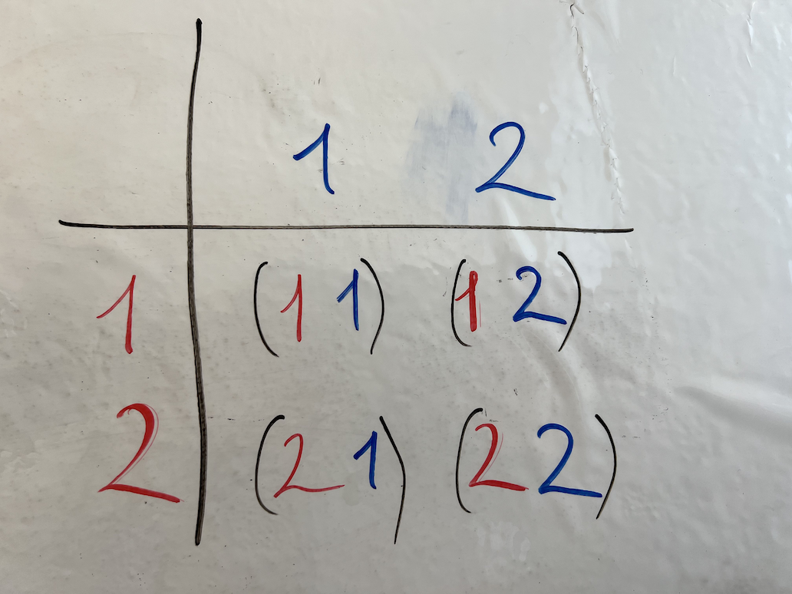
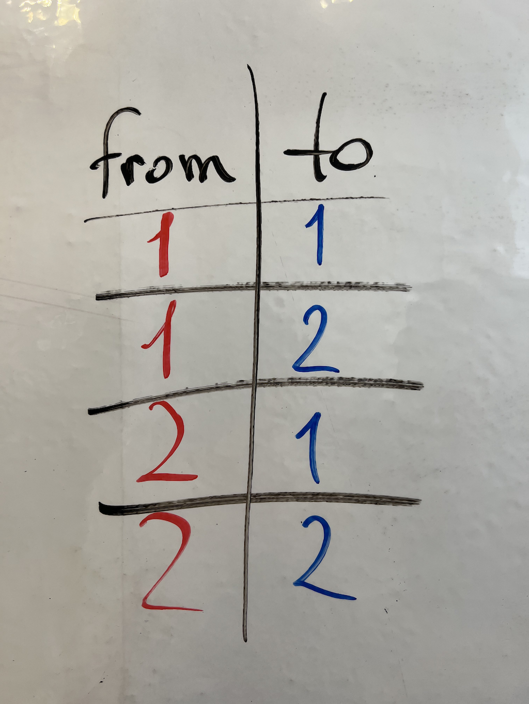
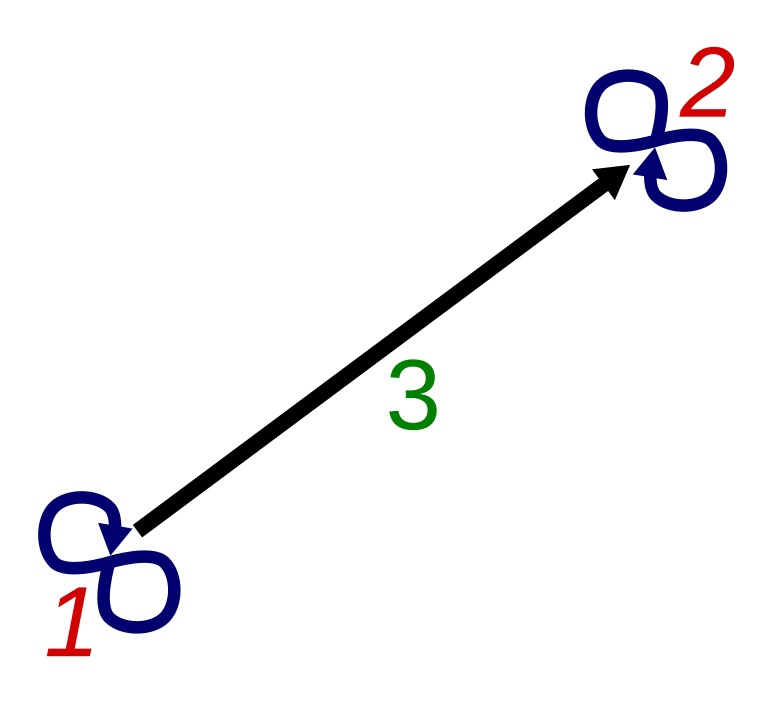
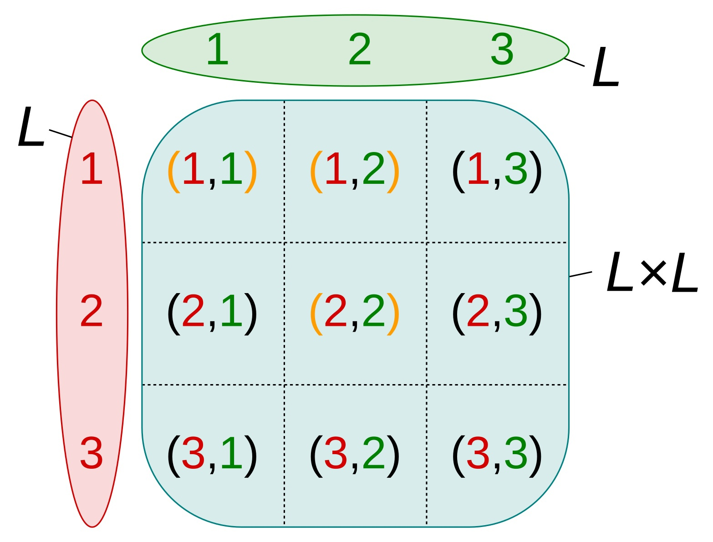
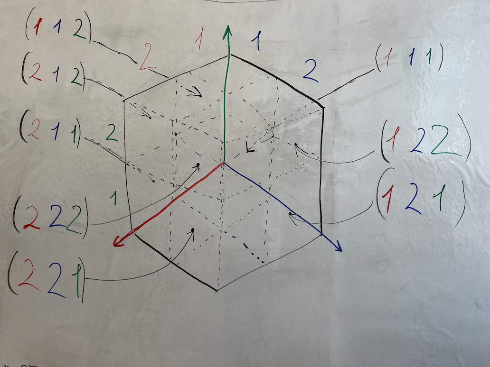
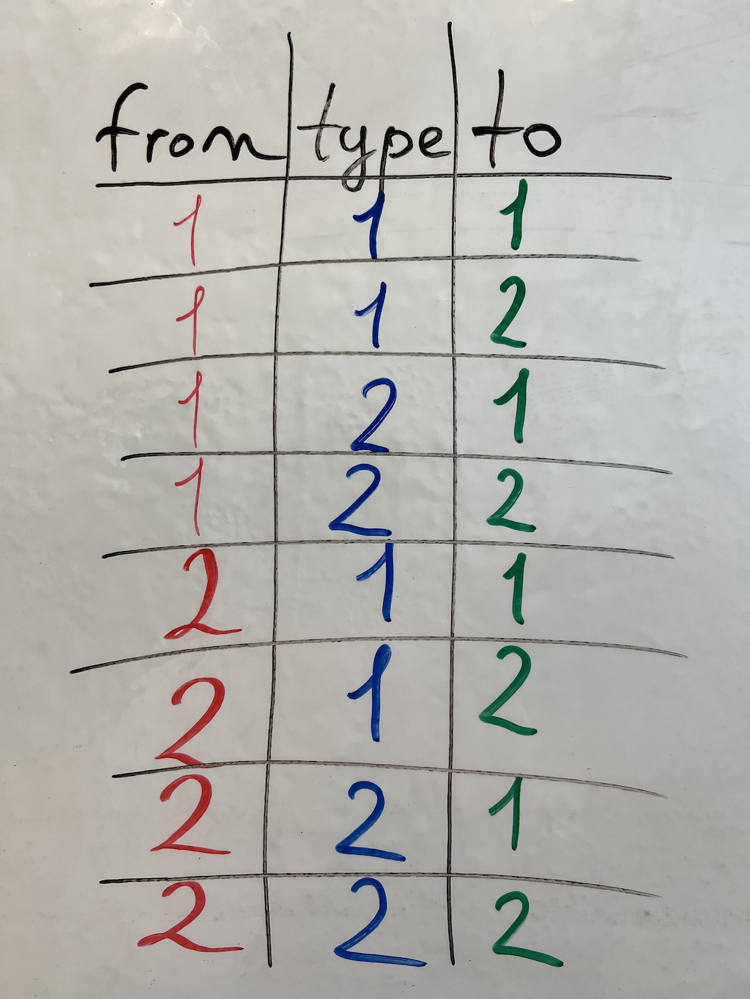
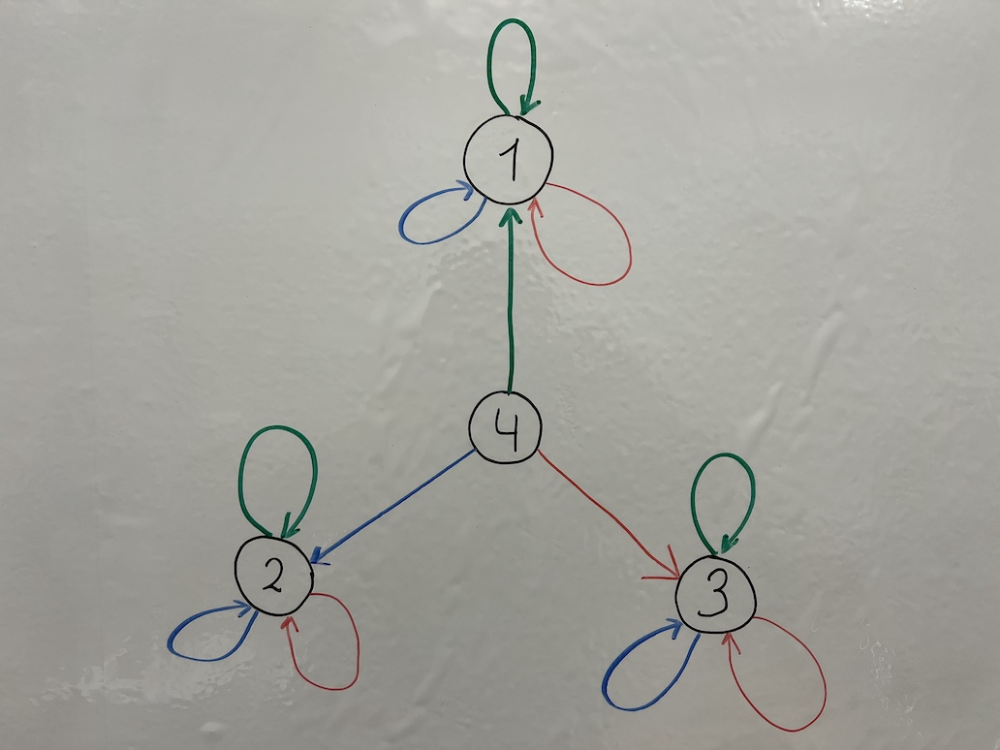

# Введение в глубокую теорию математики

Статья написана в продолжение [предыдущей статьи](https://habr.com/ru/post/656879/).

## Введение

В этой статье нам хотелось бы сравнить основные математические основы двух самых популярных теорий и ассоциативной теории.

## Реляционная алгебра

Реляционная алгебра и [реляционная модель](https://en.wikipedia.org/wiki/Relational_model) основаны на понятии отношения и n-кортежей.

Отношение определяется как [множество](https://en.wikipedia.org/wiki/Set_(mathematics)) [n-кортежей](https://en.wikipedia.org/wiki/Tuple):

> $\mathbf{R \subseteq S_1 \times S_2 \times \dots \times S_n}.$ [1]

Где:

* $\mathbf{R}$ обозначает отношение (таблицу);
* $\mathbf{S_n}$ обозначает область определения каждого столбца;
* Строки или элементы множества $\mathbf{R}$ представлены в виде n-кортежей.

Данные в реляционной модели группируются в отношения. Используя n-кортежи в реляционной модели, можно точно представить любую возможную структуру данных. Но нужны ли вообще n-кортежи? Например, каждый n-кортеж можно представить в виде вложенных упорядоченных пар (2-кортежей). Также не часто практикуется, что столбцы в таблицах используются в качестве индексов для элементов последовательности (n-кортеж). В некоторых базах данных даже запрещено использовать более $\mathbf{32}$ столбцов в таблице и ее строке (n-кортеж). Так что $\mathbf{N}$ обычно меньше $\mathbf{32}$. Поэтому, в этом случае, нет реальных n-кортежей, даже в современных реляционных базах данных.

## Определение направленного графа

Направленный граф и графы в целом основаны на понятиях вершины и ребра (2-кортежа).

[Направленный граф](https://en.wikipedia.org/wiki/Directed_graph) $\mathbf{G}$ определяется как упорядоченная пара $\mathbf{G(V, E)}$:

> $\mathbf{G(V, E) = \langle V, E \rangle, \quad V \neq \emptyset, \quad \langle \\{ v_1, v_2 \\}, \prec \rangle \in E, \quad v \in V}.$

Где:

* $\mathbf{V}$ - это [множество](https://en.wikipedia.org/wiki/Set_(mathematics)), элементы которого называются [вершинами](https://en.wikipedia.org/wiki/Vertex_(graph_theory)), узлами или точками;
* $\mathbf{E}$ - это множество [упорядоченных пар](https://en.wikipedia.org/wiki/Ordered_pair) (2-кортежей) вершин, называемых дугами, направленными ребрами (иногда просто ребрами), стрелками или направленными линиями.

Данные в модели графа представлены в виде коллекции узлов и ребер, и можно использовать эту модель практически для всего, кроме последовательностей (n-кортежей). Ну, возможно, их можно представить [последовательности в виде множеств](https://en.wikipedia.org/wiki/Tuple#Tuples_as_nested_sets), но на наш взгляд это запутанный способ представления последовательностей. Вероятно, не одни мы так считаем, что может объяснить, почему мы не смогли найти примеры, в которых другие люди так делали.

## Ассоциативная теория

Ассоциативная теория основана на понятии связи.

Связь определяется как [n-кортеж](https://en.wikipedia.org/wiki/Tuple) ссылок на связи.

### Дуплеты

Дуплет также известен как 2-кортеж или [упорядоченная пара](https://en.wikipedia.org/wiki/Ordered_pair#:~:text=In%20mathematics%2C%20an%20ordered%20pair,%7Bb%2C%20a%7D.).

```python
L = { 1 , 2 }

L × L = {
  (1, 1),
  (1, 2),
  (2, 1),
  (2, 2),
}
```





Сеть дуплетов определяется как:

> $\mathbf{\lambda: L \to L \times L, \quad L \neq \emptyset, \quad \forall a,b \in L, \quad a \neq b \Rightarrow \lambda(a) \neq \lambda(b)}.$

Где:

* $\mathbf{\lambda}$  обозначает функцию, которая определяет сеть дуплетов;
* $\mathbf{L}$ обозначает множество индексов связей.

Пример:

> $1 \to (1, 1)$
> 
> $2 \to (2, 2)$
> 
> $\mathbf{3 \to (1, 2)}$



Графовое представление сети дуплетов в виде графа.



Это Графовое представление декартова произведения, которое представляет значения связей. Значения связей с оранжевыми скобками выбраны функцией $\mathbf{\lambda}$ в примере.

Данные в сети дуплетов представлены с использованием дуплетов (2-кортежей).

Дуплеты могут:

* связывать объект со своими свойствами;
* связывать два дуплета вместе, чего не позволяет теория графов;
* представлять любую последовательность (n-кортеж) в виде дерева, построенного из вложенных упорядоченных пар.

Благодаря этому дуплеты могут представлять любую возможную структуру данных.

### Триплеты

Триплет также известен как 3-кортеж.

```python 
L = { 1 , 2 }

L × L = {
  (1, 1),
  (1, 2),
  (2, 1),
  (2, 2),
}

L × L × L = {
  (1, 1, 1),
  (1, 1, 2),
  (1, 2, 1),
  (1, 2, 2),
  (2, 1, 1),
  (2, 1, 2),
  (2, 2, 1),
  (2, 2, 2),
}
```





Сеть триплетов определяется как:

> $\mathbf{\lambda : L \to L \times L \times L, \quad L \neq \emptyset, \quad \forall a,b \in L, \quad a \neq b \Rightarrow \lambda(a) \neq \lambda(b).}$

Где:

* $\mathbf{\lambda}$ обозначает функцию, определяющую сеть триплетов;
* $\mathbf{L}$ обозначает набор индексов ссылок.

Пример:

> $1 \to (1, 1, 1)$
> 
> $2 \to (2, 2, 2)$
> 
> $3 \to (3, 3, 3)$
>
> $\mathbf{4 \to (1, 2, 3)}$



Графовое представление сети триплетов в виде графа.

Данные в сети триплетов представлены с использованием триплетов (3-кортежей).

Триплеты могут делать то же, что и дуплеты, а также позволяют указывать типы или значения непосредственно для каждой ссылки.

### Последовательности

Последовательность также известна как [n-кортеж](https://en.wikipedia.org/wiki/Tuple).

Сеть ссылок в общем определяется как:

> $\mathbf{\lambda : L \rightarrow \underbrace{ L \times L \times \ldots \times L}_{n}, \quad L \neq \emptyset, \quad \forall a,b \in L, \quad a \neq b \Rightarrow \lambda(a) \neq \lambda(b).}$

Где:

* $\mathbf{\lambda}$ обозначает функцию, определяющую сеть ссылок;
* $\mathbf{L}$ обозначает набор индексов ссылок.

Пример:

> $1 \to (1)$
> 
> $2 \to (2, 2)$
> 
> $3 \to (3, 3, 3)$
>
> $\mathbf{4 \to (1, 2, 3, 2, 1)}$

В этом примере используются n-кортежи переменной длины для значений ссылок.

Последовательности по сути эквивалентны в выразительной силе с реляционной моделью. Но когда было замечено, что дуплеты и триплеты достаточны для представления последовательностей любого размера, то появилось предположение об отсутвии необходимости использовать сами последовательности напрямую.

## Заключение

Реляционная модель данных может представить все, включая Ассоциативную модель. Графовая же модель особенно хороша в представлении отношений и не так хороша в представлении последовательностей.

Ассоциативная модель может легко представить n-кортеж неограниченной длины с использованием кортежей с $\mathbf{n \geq 2}$, она столь же хороша, как теория графов, в своей способности представлять ассоциации, и она также мощна, как реляционная модель, и может полностью представить любую таблицу SQL.

В реляционной модели нет необходимости в более чем одном отношении, чтобы заставить ее вести себя как ассоциативная модель. И в этом отношении нет необходимости в более чем 2-3 столбцах, кроме явного ID или встроенного ID строки.

Графовая модель не имеет возможности напрямую создавать ребро между ребрами по определению. Поэтому Графовой модели требуется либо изменить свое определение, либо расширить его с помощью некоторого дополнительного способа хранения последовательностей. Возможно, на самом деле можно хранить последовательности в виде вложенных наборов внутри Графвовые модели, но этот способ не популярен. Графовая модель - ближайшая модель к дуплетам, но она все равно отличается.

Использование ассоциативной модели означает, что больше не нужно выбирать между базами данных SQL и NoSQL, просто есть ассоциативное хранилище данных, которое может представить все самым простым возможным способом. И данные всегда находятся в наиболее близкой к оригиналу форме.

## Ссылки

1. “Relational Model of Data for Large Shared Data Banks.”, paragraph 1.3., Edgar F. Codd, IBM Research Laboratory, San Jose, California, June 1970